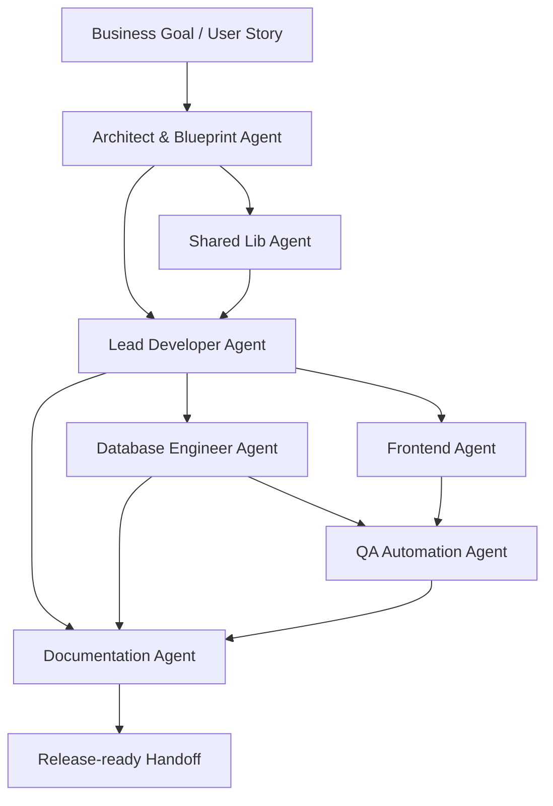

# OunJai Agent Operating Model

เอกสารนี้กำหนดวิธีให้ AI Agents ทำงานร่วมกันแบบ software house ที่คุมคุณภาพได้ ไม่ใช่แค่ปั่นโค้ดแยกกัน

## 1. Operating Principles

1. **Blueprint first** - ทุกงานเริ่มจาก `blueprints/system-blueprint.json`
2. **Contract before implementation** - งานที่มีหลาย service ต้องตกลง proto/API contract ก่อนลง code
3. **Shared before duplicate** - code ที่ซ้ำกันต้องถูกย้ายไป `/libs/common`
4. **Tests follow risk** - payment, trip, identity และ location ต้องมี test หนาแน่นกว่าส่วนทั่วไป
5. **Handoff always** - ทุก agent ต้องส่ง handoff note เพื่อให้ agent ถัดไปทำงานต่อได้

## 2. Default Workflow



## 3. Task Intake Template

ทุก task ควรมีข้อมูลนี้ก่อนส่งให้ agent:

```md
## Goal
งานนี้ต้องการผลลัพธ์อะไร

## Scope
service/app/libs ที่อนุญาตให้แก้

## Source of truth
- blueprints/system-blueprint.json
- related proto/API/schema/user story

## Acceptance Criteria
- เงื่อนไขที่ต้องผ่าน
- edge cases
- security/consistency/performance expectation

## Required Output
- code/docs/tests/diagram
- command ที่ต้องรันเพื่อตรวจสอบ
```

## 4. Handoff Note Template

ทุก agent ต้องจบงานด้วย note แบบนี้:

```md
## Handoff

### Changed Files
- path/to/file: ทำอะไรและทำไม

### Decisions
- decision: เหตุผลและ trade-off

### Validation
- command: result

### Risks
- risk/severity/mitigation

### Next Actions
- งานถัดไปที่ agent อื่นควรทำ
```

## 5. Quality Gates

### Architecture Gate

- service boundaries ไม่ทับซ้อนกัน
- data ownership ชัดเจน
- cross-service calls มี timeout/retry/idempotency strategy
- breaking change มี ADR และ migration plan

### Backend Gate

- service name, port และ database provider ตรง blueprint
- มี Domain/Data/Infrastructure/Presentation layers
- controller/gRPC handler ไม่มี business logic หนา
- ใช้ `/libs/common` สำหรับ proto, logger, exception, DTO และ base repository

### Database Gate

- TypeORM entities มี constraints/indexes ที่รองรับ query จริง
- Mongoose schemas มี indexes ตาม read/write pattern
- `location-service` ใช้ `2dsphere` index สำหรับ real-time tracking
- `trip-service` และ `payment-service` มี consistency strategy เช่น Saga หรือ Outbox

### Frontend Gate

- API client generate หรือ type-safe จาก contract
- critical flows มี loading/error/empty states
- auth/role-based access ถูกบังคับทั้ง UI และ API
- mobile tracking flow รองรับ reconnect/retry

### QA Gate

- unit tests ครอบคลุม domain rules
- integration/contract tests ครอบคลุม gateway และ gRPC
- payment/trip flow ตรวจ idempotency และ partial failure
- test report map กับ acceptance criteria

### Documentation Gate

- service ทุกตัวมี README
- gateway มี Swagger/OpenAPI หรือ Postman collection
- critical flows มี sequence diagram
- runbook อธิบาย env, local run, migration และ troubleshooting

## 6. Critical Flow Ownership

| Flow | Primary Agents | Required Checks |
| --- | --- | --- |
| Login/RBAC | Architect, Lead Dev, QA | JWT lifecycle, role matrix, unauthorized tests |
| Driver Location Tracking | Database Engineer, Lead Dev, Frontend, QA | 2dsphere index, latency, reconnect, stale location |
| Trip Booking | Architect, Lead Dev, Database Engineer, QA | state machine, concurrency, cancellation, idempotency |
| Payment | Architect, Database Engineer, QA | outbox, reconciliation, duplicate charge prevention |
| Notification | Lead Dev, QA, Docs | event delivery, retry, user preference |

## 7. Recommended Agent Sequence for OunJai Build

1. **Architect & Blueprint Agent** - lock service boundaries and critical flows
2. **Shared Lib Agent** - create `/libs/common` contracts and cross-cutting modules
3. **Lead Developer Agent** - generate services and gateway skeletons
4. **Database Engineer Agent** - add entities/schemas/indexes/migrations
5. **Frontend Agent** - create driver/customer/admin flows from gateway contract
6. **QA Automation Agent** - add automated tests and acceptance matrix
7. **Documentation Agent** - finalize README, Swagger/Postman and diagrams
