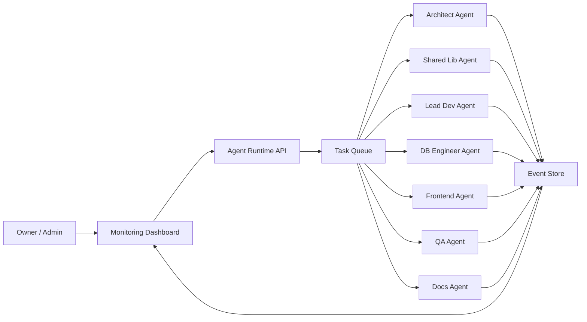

# OunJai Monitoring Dashboard

เป้าหมายของ dashboard คือทำให้เจ้าของงานเห็นว่า AI Software House กำลังทำอะไร ใครติด blocker ตรงไหน และ service ใดพร้อมแค่ไหน

## สิ่งที่ monitor ตอนนี้

- **Agents Online** - จำนวน agent ที่ register และมี run state
- **Active Work** - งานที่กำลังทำใน queue
- **Blocked** - งานที่ต้องการ decision หรือข้อมูลเพิ่ม
- **Avg Health** - health signal เฉลี่ยของ agent runs
- **Agent Runs** - current task, progress, queue depth, last signal และ risk
- **Active Task Board** - owner, priority, state และ acceptance gate
- **Event Stream** - handoff, decision, test, blocker และ deploy events
- **Microservice Build Map** - readiness ของ service จาก `system-blueprint.json`

## Data Contract

ใช้ `blueprints/monitoring-schema.json` เป็น contract กลางระหว่าง agent runtime กับ dashboard

สำหรับการรัน dashboard บน Mac แล้วดู agents ที่ทำงานบน remote ให้ตั้งค่า:

```bash
AGENT_RUNTIME_URL=http://localhost:4000
AGENT_RUNTIME_PORT=4000
AGENT_RUNTIME_TOKEN=
```

ดูขั้นตอนละเอียดได้ที่ `docs/operations/local-mac-remote-monitoring.md`

agent runtime ควร emit events ต่อไปนี้:

```text
agent_run.started
agent_run.heartbeat
work_item.state_changed
agent_event.created
handoff.created
agent_run.completed
agent_run.failed
```

## Runtime ที่ควรต่อเพิ่ม

ขั้นต่อไปสำหรับทำให้ทีม AI "ทำงานจริง" คือเพิ่ม orchestrator service ที่รับ task brief แล้ว dispatch งานให้ agent:



## Minimal Backend API ที่ควรมี

```http
GET /health
GET /api/agents
GET /api/work-items
GET /api/events
GET /api/services/readiness
GET /api/snapshot
POST /api/work-items
POST /api/agent-runs/:id/events
POST /api/agent-runs/:id/heartbeat
PATCH /api/work-items/:id/state
```

## Storage Recommendation

- **PostgreSQL** สำหรับ work items, agent runs, handoffs และ audit log
- **Redis** สำหรับ queue และ real-time pub/sub
- **Object storage** สำหรับ artifacts เช่น screenshots, generated docs และ reports

## Production Gates

- ทุก event ต้องมี correlation id
- ทุก handoff ต้อง trace ไปยัง work item ได้
- blocked task ต้องมี owner และ required decision
- critical task ต้องมี acceptance gate
- dashboard ต้องแสดง last heartbeat ของ agent ทุกตัว
